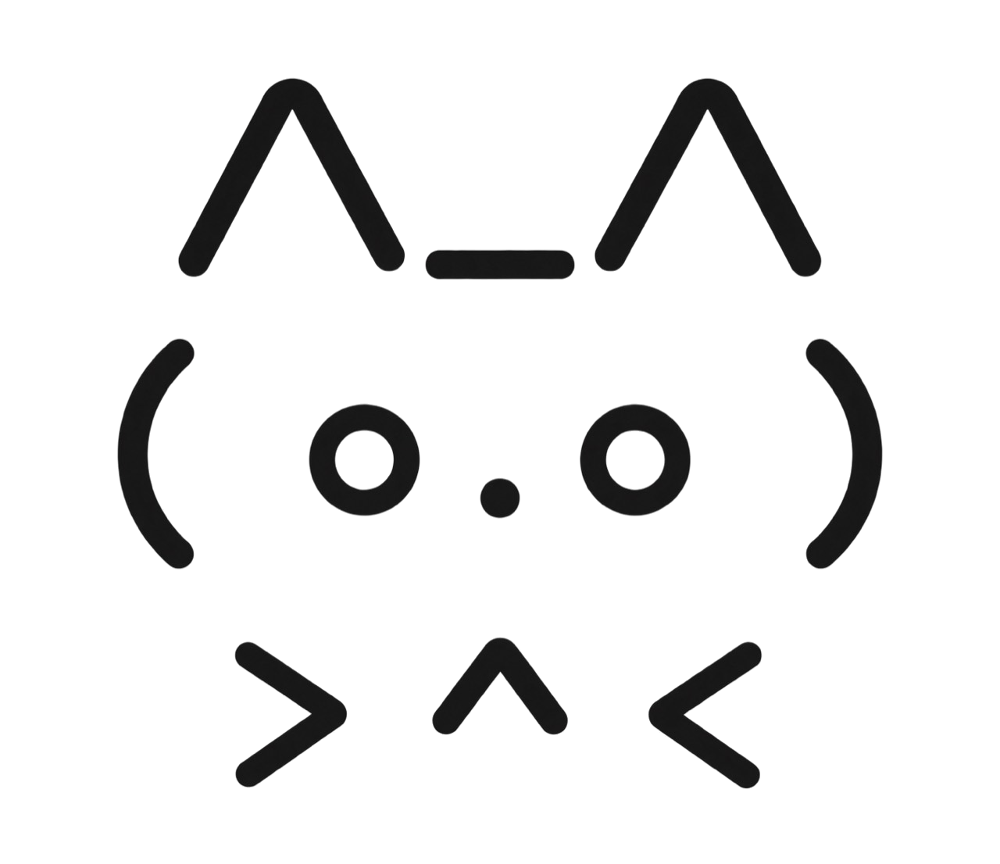

<p align="center">
  
</p>

<h1 align="center">NoIMG</h1>

<p align="center">
  <a href="https://github.com/jhuang-tw/noimg/actions/workflows/ci.yml"></a>
  <a href="LICENSE"></a>
  
  
  
</p>

<p align="center"><strong>Stop agents from generating images when nobody asked for one.</strong></p>

<p align="center"><code>@noimg</code> means explicit <strong>NON-IMAGE OUTPUT</strong>.</p>

---

You:

```text
@noimg show me the architecture
```

Agent:

```text
Generating a cinematic image now...
```

You: `(ಠ_ಠ)`

That is the bug NoIMG exists to prevent.

```text
@noimg
→ HARD BLOCK image generation / editing / rendering
→ keep doing the actual task
```

Mermaid, SVG source, HTML, code, ASCII, and compatible tools can keep going. The pixels simply lose voting rights.

## Public edition: deliberately boring

NoIMG's public runtime is **stdio only**.

- no HTTP server
- no open port
- no ngrok
- no Cloudflare Worker
- no OAuth
- no tokens
- no telemetry
- no runtime outbound network

One process talks to one local MCP client over stdin/stdout. That is it. We bravely resisted adding a control plane.

## Try it from source

> **The npm package is not published yet.** If npm currently offers you a package named `noimg`, it is not this project. Do not run it.

```bash
git clone https://github.com/jhuang-tw/noimg.git
cd noimg
npm ci
npm run build
node dist/cli.js
```

Configure your MCP client to launch:

```text
node /absolute/path/to/noimg/dist/cli.js
```

See [docs/usage.md](docs/usage.md) for client examples.

## Docs

- [Usage](docs/usage.md)
- [Development](docs/development.md)
- [Security policy](SECURITY.md)

## License

MIT. Use it responsibly, preferably without accidentally inventing NoIMG Enterprise.
